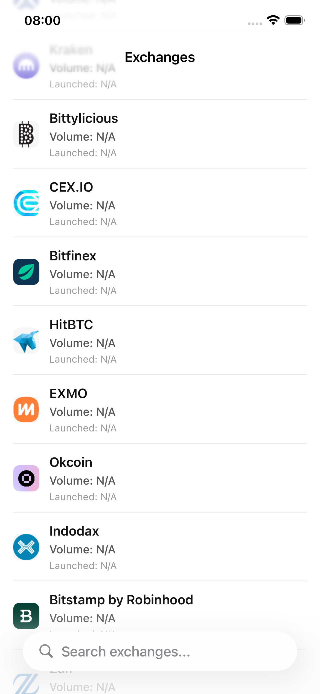
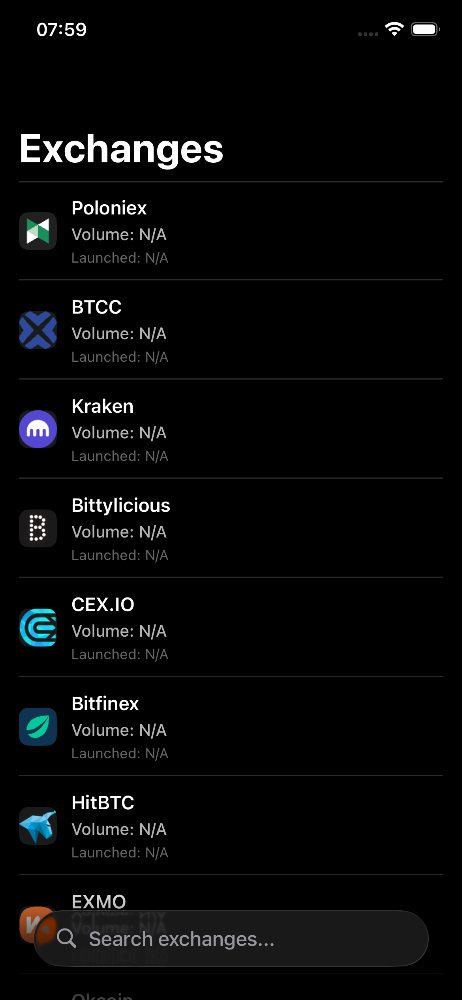
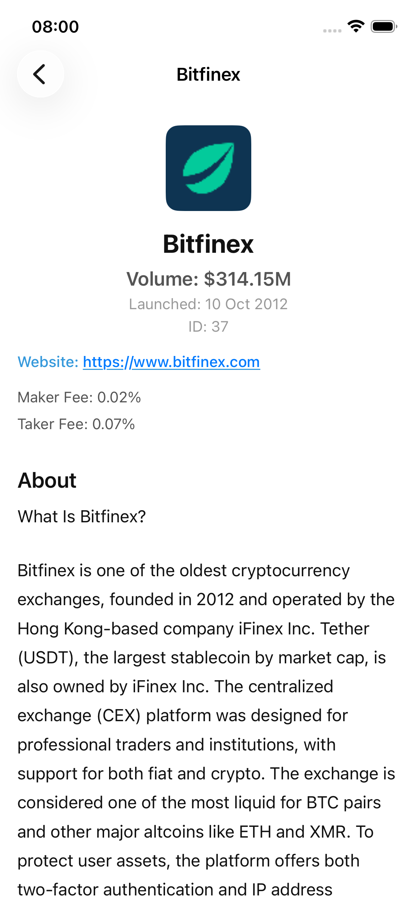
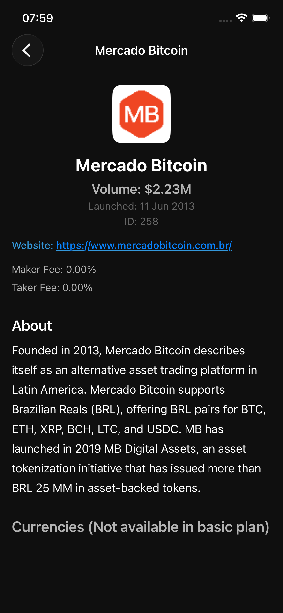
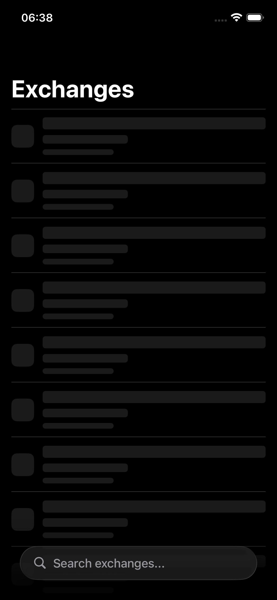
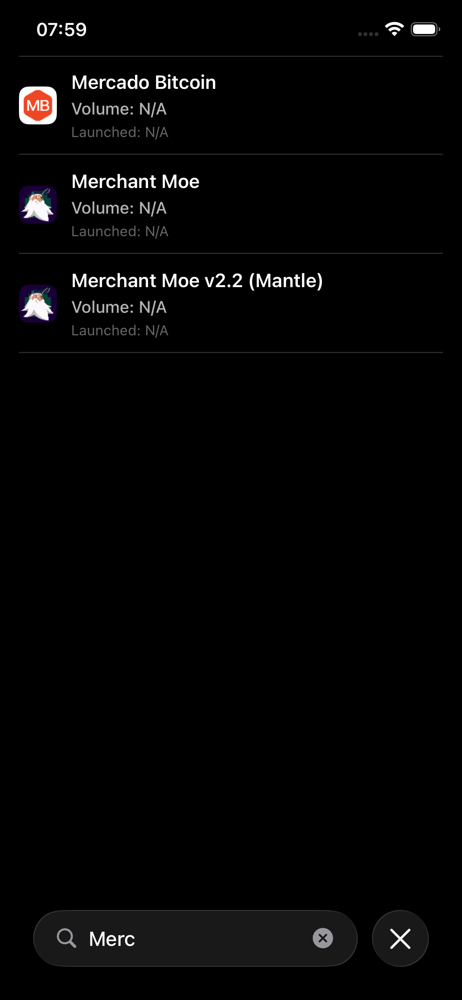

# CoinMarketCap iOS App

<div align="center">


**Aplicativo iOS desenvolvido como desafio técnico para o Mercado Bitcoin**

[📱 TestFlight Beta](https://testflight.apple.com/join/y6Xts8zA) • [📖 Documentação](#-arquitetura) • [🧪 Testes](#-testes)

</div>

---

## 📱 Sobre o Projeto

Aplicativo iOS que consome a API do CoinMarketCap para exibir informações sobre exchanges de criptomoedas, incluindo listagem de exchanges, detalhes de cada exchange e suas moedas disponíveis.

### 🎯 Principais Características

- ✅ **Listagem de Exchanges** com volume e data de lançamento
- ✅ **Detalhes Completos** da Exchange com descrição formatada
- ✅ **Listagem de Moedas** disponíveis na exchange
- ✅ **Tratamento de Erros** com feedback visual e retry
- ✅ **Loading States** com shimmer effect
- ✅ **Busca em Tempo Real** de exchanges
- ✅ **Interface Moderna** seguindo Design System próprio
- ✅ **Navegação Fluida** entre telas
- ✅ **Suporte a Dark Mode** e Light Mode
- ✅ **Localização** preparada para múltiplos idiomas

## 📸 Screenshots

### Lista de Exchanges

<div align="center">

| Light Mode | Dark Mode |
|:----------:|:---------:|
|  |  |

</div>

### Detalhes da Exchange

<div align="center">

| Light Mode | Dark Mode |
|:----------:|:---------:|
|  |  |

</div>

### Estados da Interface

<div align="center">

| Loading (Shimmer) | Busca/Filtro |
|:-----------------:|:------------:|
|  |  |

</div>

### Testes

<div align="center">


</div>

## 🚀 TestFlight Beta

Teste o aplicativo antes do lançamento oficial através do TestFlight:

**[👉 Baixar no TestFlight](https://testflight.apple.com/join/y6Xts8zA)**

### Como Participar do Beta

1. Instale o **TestFlight** na App Store
2. Abra o link acima no seu iPhone/iPad
3. Toque em **Accept** e depois em **Install**

> ⚠️ **Nota**: Você precisa ter iOS 16 ou superior para usar o TestFlight

## 🏗️ Arquitetura

O projeto segue os princípios de **Clean Architecture** com **VIP-C** (VIP + Coordinator):

- **VIP-C (VIP + Coordinator)**: Separação clara de responsabilidades entre View, Interactor, Presenter e Coordinator
- **SOLID**: Princípios aplicados em todas as camadas
- **View Code**: Interface construída programaticamente (sem Storyboard)
- **Clean Architecture**: Separação em camadas (Domain, Data, Features)
- **Dependency Injection**: Container centralizado para gerenciamento de dependências
- **Protocol-Oriented**: Uso extensivo de protocolos para desacoplamento

### Estrutura de Camadas

```
CoinMarketCapApp
│
├── App                    # Configuração inicial e Coordinators
├── Core                   # Componentes compartilhados
│   ├── Networking         # HTTPClient, Endpoint, APIError
│   ├── DI                 # Dependency Injection Container
│   ├── ImageLoading       # ImageLoader com cache
│   └── Utils              # Extensões e utilitários (DateFormatter, MarkdownFormatter, LocalizedString)
├── Data                   # Camada de dados
│   ├── Services           # Implementação dos serviços
│   └── DTO                # Data Transfer Objects
├── Domain                 # Regras de negócio
│   ├── Models             # Entidades do domínio
│   └── UseCases           # Casos de uso
├── Features               # Features da aplicação
│   ├── ExchangesList      # Lista de exchanges
│   └── ExchangeDetail     # Detalhes da exchange
├── DesignSystem           # Sistema de design
│   ├── Colors             # DSColor
│   ├── Typography         # DSTypography
│   ├── Theme              # DSTheme (Spacing, Size, CornerRadius, etc.)
│   └── Components         # Componentes reutilizáveis
└── Resources              # Recursos (Localizable.strings, Assets)
```

## ✨ Funcionalidades Detalhadas

### Lista de Exchanges
- Listagem paginada de exchanges
- Exibição de volume formatado (B/M/K)
- Data de lançamento formatada
- Busca em tempo real
- Shimmer loading durante carregamento
- Estado vazio quando não há resultados
- Tratamento de erros com retry

### Detalhes da Exchange
- Informações completas da exchange
- Logo da exchange com fallback
- Volume e data de lançamento
- Website clicável (hyperlink)
- Taxas (maker/taker) quando disponíveis
- Descrição formatada com suporte a Markdown
- Lista de moedas disponíveis com preços em USD
- Tratamento de limitações de plano da API

### Design System
- Cores semânticas (Primary, Secondary, Error, Success, etc.)
- Tipografia consistente
- Espaçamentos padronizados
- Componentes reutilizáveis
- Suporte a Dark/Light Mode

## 🛠️ Tecnologias

- **Swift 5.9+**
- **UIKit** (View Code - sem Storyboard)
- **URLSession** para networking
- **XCTest** para testes unitários e snapshot
- **VIP-C** para arquitetura
- **SOLID** principles
- **Localization** preparado para múltiplos idiomas

## 📋 Pré-requisitos

- Xcode 14.0 ou superior
- iOS 15.0 ou superior
- API Key do CoinMarketCap (Basic Plan ou superior)

## 🚀 Como Rodar

### 1. Clone o repositório

```bash
git clone <repository-url>
cd MB/CoinMarketCapApp
```

### 2. Configure a API Key

Crie o arquivo `CoinMarketCapApp/.xcconfig/Secrets.xcconfig`:

```bash
mkdir -p CoinMarketCapApp/.xcconfig
touch CoinMarketCapApp/.xcconfig/Secrets.xcconfig
```

Adicione sua API Key no arquivo:

```
CMC_API_KEY = sua_api_key_aqui
```

> ⚠️ **IMPORTANTE**: O arquivo `Secrets.xcconfig` está no `.gitignore` e não será commitado

### 3. Abra o projeto no Xcode

```bash
open CoinMarketCapApp.xcodeproj
```

### 4. Build e execute

- Pressione `⌘ + R` para buildar e executar
- Ou selecione **Product > Run** no menu do Xcode

## 🧪 Testes

O projeto inclui **103 testes unitários** com alta cobertura:

### Executar Testes

```bash
# No Xcode
⌘ + U

# Ou via terminal
xcodebuild test -project CoinMarketCapApp.xcodeproj -scheme CoinMarketCapApp
```

### Cobertura de Testes

- ✅ **Use Cases**: `FetchExchangesUseCaseTests`, `FetchExchangeDetailUseCaseTests`, `FetchCurrenciesUseCaseTests`
- ✅ **Interactors**: `ExchangesListInteractorTests`, `ExchangeDetailInteractorTests`
- ✅ **Presenters**: `ExchangesListPresenterTests`, `ExchangeDetailPresenterTests`
- ✅ **Services**: `CoinMarketCapServiceTests`
- ✅ **Networking**: `APIErrorTests`, `EndpointTests`
- ✅ **Utils**: `DateFormatterTests`, `MarkdownFormatterTests`
- ✅ **ViewControllers**: `ExchangeDetailViewControllerTests`
- ✅ **Views**: `ExchangeDetailViewTests`, `ExchangeDetailViewSnapshotTests`
- ✅ **Error Handling**: `ExchangesListErrorHandlerTests`
- ✅ **Image Loading**: `ImageLoaderTests`
- ✅ **DTOs**: `CurrencyDTOTests`

### Mocks e Spies

- `MockHTTPClient`: Mock para testes de networking
- `MockCoinMarketCapService`: Mock do serviço principal
- `MockImageLoader`: Mock para carregamento de imagens
- `FetchExchangesUseCaseMock`: Mock do use case
- `ExchangesListPresenterSpy`: Spy para verificar chamadas do presenter

## 📐 Decisões Técnicas

### VIP-C Architecture

- **View**: Responsável apenas pela apresentação visual (View Code)
- **Interactor**: Contém a lógica de negócio e coordena use cases
- **Presenter**: Formata dados do domínio para ViewModels
- **Coordinator**: Gerencia navegação entre telas (desacoplamento)

### SOLID Principles

- **Single Responsibility**: Cada classe tem uma única responsabilidade
- **Open/Closed**: Extensível via protocolos, fechado para modificação
- **Liskov Substitution**: Implementações podem ser substituídas via protocolos
- **Interface Segregation**: Protocolos específicos e focados
- **Dependency Inversion**: Dependências via protocolos, não implementações concretas

### Networking

- Protocol `HTTPClient` permite fácil mock para testes
- `Endpoint` struct para construção de URLs type-safe
- Tratamento de erros com `APIError` enum
- Fallback automático para endpoints básicos quando API plan não suporta endpoints premium
- Tratamento específico para erro 1006 (limitação de plano)

### Dependency Injection

- `AppContainer` centraliza todas as dependências
- Facilita testes e manutenção
- Permite troca de implementações facilmente
- Singleton apenas para o container

### Localization

- Arquivo `Localizable.strings` centralizado
- Helper `LocalizedString` para acesso type-safe
- Todas as strings hardcoded foram substituídas
- Preparado para múltiplos idiomas

### Design System

- Cores semânticas (`DSColor`)
- Tipografia consistente (`DSTypography`)
- Espaçamentos padronizados (`DSTheme.Spacing`)
- Tamanhos padronizados (`DSTheme.Size`)
- Componentes reutilizáveis

## 📁 Estrutura de Arquivos

```
CoinMarketCapApp/
├── App/
│   └── AppCoordinator.swift
├── Core/
│   ├── Networking/
│   │   ├── HTTPClient.swift
│   │   ├── URLSessionHTTPClient.swift
│   │   ├── Endpoint.swift
│   │   └── APIError.swift
│   ├── DI/
│   │   └── AppContainer.swift
│   ├── ImageLoading/
│   │   └── ImageLoader.swift
│   └── Utils/
│       ├── DateFormatter+.swift
│       ├── MarkdownFormatter.swift
│       └── LocalizedString.swift
├── Data/
│   ├── Services/
│   │   └── CoinMarketCapService.swift
│   └── DTO/
│       ├── ExchangeDTO.swift
│       ├── CurrencyDTO.swift
│       └── APIErrorResponse.swift
├── Domain/
│   ├── Models/
│   │   ├── Exchange.swift
│   │   └── Currency.swift
│   └── UseCases/
│       ├── FetchExchangesUseCase.swift
│       ├── FetchExchangeDetailUseCase.swift
│       └── FetchCurrenciesUseCase.swift
├── Features/
│   ├── ExchangesList/
│   │   ├── ExchangesListViewController.swift
│   │   ├── ExchangesListView.swift
│   │   ├── ExchangesListInteractor.swift
│   │   ├── ExchangesListPresenter.swift
│   │   ├── ExchangesListModels.swift
│   │   ├── ExchangesListCoordinator.swift
│   │   ├── ExchangesListErrorHandler.swift
│   │   ├── EmptyStateView.swift
│   │   └── ShimmerTableViewCell.swift
│   └── ExchangeDetail/
│       ├── ExchangeDetailViewController.swift
│       ├── ExchangeDetailView.swift
│       ├── ExchangeDetailInteractor.swift
│       ├── ExchangeDetailPresenter.swift
│       ├── ExchangeDetailModels.swift
│       └── ExchangeDetailCoordinator.swift
├── DesignSystem/
│   ├── Colors/
│   │   └── DSColor.swift
│   ├── Typography/
│   │   └── DSTypography.swift
│   ├── Theme/
│   │   └── DSTheme.swift
│   └── Components/
│       ├── DSButton.swift
│       └── DSTextField.swift
└── Resources/
    └── Localizable.strings
```

## 🔒 Segurança

- ✅ API Key armazenada em arquivo `.xcconfig` local
- ✅ Arquivo `Secrets.xcconfig` adicionado ao `.gitignore`
- ✅ Nunca commitar credenciais no repositório
- ✅ Tratamento seguro de erros sem expor informações sensíveis

## 📝 Checklist de Submissão

- ✅ Repositório organizado e estruturado
- ✅ README claro e completo com screenshots
- ✅ Arquitetura VIP-C implementada corretamente
- ✅ Código testável com 103 testes unitários
- ✅ API Key protegida (não commitada)
- ✅ Sem Storyboard (100% View Code)
- ✅ UI fluida e moderna com Design System
- ✅ Padrões iOS respeitados
- ✅ SOLID aplicado em todas as camadas
- ✅ Clean Architecture com separação de responsabilidades
- ✅ Localização preparada para múltiplos idiomas
- ✅ Tratamento de erros robusto
- ✅ Suporte a Dark/Light Mode

## 🎨 Design System

O projeto utiliza um Design System próprio para garantir consistência visual:

- **Cores**: Sistema de cores semânticas com suporte a Dark/Light Mode
- **Tipografia**: Hierarquia tipográfica consistente
- **Espaçamentos**: Grid de espaçamentos padronizados
- **Componentes**: Componentes reutilizáveis (Button, TextField, etc.)

## 🌐 Localização

O aplicativo está preparado para múltiplos idiomas:

- Arquivo `Localizable.strings` centralizado
- Todas as strings hardcoded foram substituídas
- Helper type-safe para acesso às strings
- Fácil adicionar novos idiomas criando arquivos `.lproj`

## 📊 Métricas

- **103 testes unitários** executando com sucesso
- **Alta cobertura** de código testado
- **0 warnings** de compilação
- **Arquitetura limpa** e manutenível

## 👨‍💻 Autor

**André Costa Dantas**

- Desenvolvido como desafio técnico para o Mercado Bitcoin
- Arquitetura VIP-C com Clean Architecture
- 100% View Code (sem Storyboard)
- Testes unitários abrangentes

## 📄 Licença

Este projeto foi desenvolvido como parte de um desafio técnico.

---

<div align="center">

**[📱 TestFlight Beta](https://testflight.apple.com/join/y6Xts8zA)** • Feito com ❤️ usando Swift e UIKit

</div>
